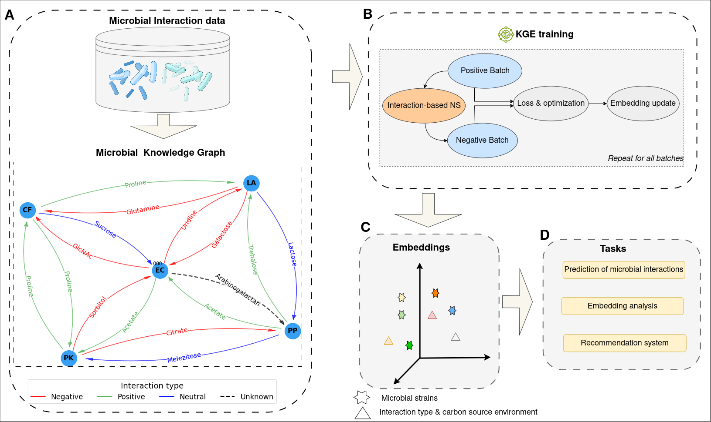

# Microbial Interaction Prediction Using Knowledge Graph Embeddings


This repository contains the materials and code for the paper **Knowledge Graph Embedding for Predicting and Analyzing Microbial Interactions**. The study presents a novel approach to modeling and predicting interactions between microbial strains across diverse carbon source environments using knowledge graph embedding techniques.

---

<div style="background-color:white">
  
</div>


## 🚀 Features

- **Knowledge Graph Construction**: Represent microbial strains as entities and interaction types/environments as relations.  
- **Embedding Methods**: Support for multiple KG embedding algorithms, including SimplE, TransE, and DistMult.  
- **Prediction & Analysis**: Predict pairwise microbial interactions and visualize learned embeddings (t-SNE, hierarchical clustering).

---


## 🛠️ Requirements

- Python 3.7 or higher  
- Install dependencies:
  ```bash
  pip install -r requirements.txt
  ```

---

## 🔧 Getting Started

### 1. Clone the Repository

```bash
git clone git@github.com:Medkne/kgemi.git
cd kgemi
```

### 2. Prepare Your Data

Convert your CSV of microbial interactions into a knowledge graph format:

```python
from utils import create_data

# Provide the path to your CSV and a name for the output folder
create_data("path/to/your_data.csv", "MKG")
```

This will generate the following in `datasets/MKG/`:

- `train.txt`, `valid.txt`, `test.txt`: Triples for training, validation, and testing  
- `ent2ids.txt`: Mapping of entity names to integer IDs  
- `rel2ids.txt`: Mapping of relation names to integer IDs  

### 3. Train & Evaluate a model

```bash
python main.py -dataset MKG -model SimplE
```

- `--dataset` specifies the folder under `datasets/`  
- `--model` can be `SimplE`, `TransE`, or `DistMult`  


### 5. Analyze Embeddings

Visualize and interpret the learned embeddings:

```bash
python embedding_analysis.py --model_path runs/MKG/SimplE
```

This generates:

- **t-SNE** 2D scatter plots of strain embeddings  
- **Hierarchical clustering** dendrogram

---

## Acknowledgments

* This code was adapted from the Pytorch implementation of [SimplE](https://github.com/baharefatemi/SimplE) paper. 
* We thank Nestor et al. for making their original data and [code](https://github.com/einatnestor/Microbial-interaction-prediction) publicly available; these resources were used in this work. 


---

## Contact

Mohammed Khatbane

Université de Lorraine, CNRS, LORIA, F-54000 Nancy, France

mohammed.khatbane@inria.fr

---

## Licence

This project is licensed under the terms of the **GNU General Public License version 3**.  
See the [LICENSE](LICENSE) file for the full text.
